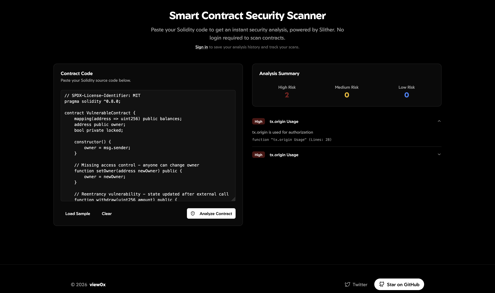
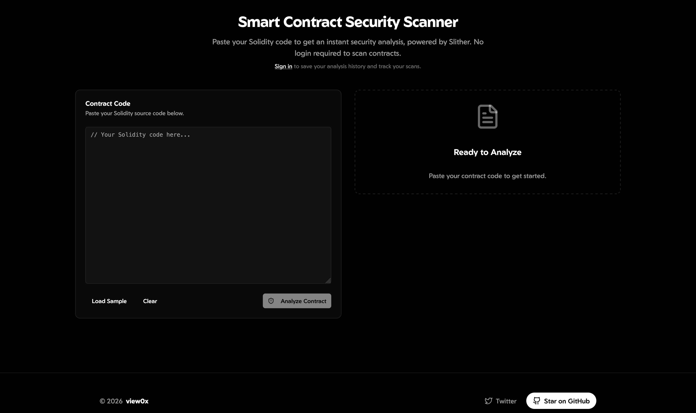

# view0x

okay, today is a new day on my one project daily aim, and i am trying to build a smart contract audit tool. i noticed people i taught in 2021 became a big deal in just 18 months of work. the universe rewards those who put in their efforts and try their best.

to be honest, i have to perfect everything with the yarn setup and then i setup docker for this to work efficiently.

finally, the vuln scanner is working fine without errors. but i think it is not detecting vulnerabilities, gas optimizations or coe quality issues, because i intentionally used bad code from one hack for this. but i think this is because some detection methods i used are still stubs and need more robust AST traversal logic.

maybe because i am not much of a ui guy, so i want to perfect the vuln detection method before doing anything about the frontend/backend integration or even the UI itself. 

So, I will implement tx.origin usage detection, unchecked external calls, weak randomness sources, missing access control, and dangerous delegatecall usage before i sleep.

i am used to getting my setup run properly on cli before trying to add a web ui for it. just to feel like a god!

okay, let me just work up the frontend at this point. let's even see what i have going. i downgraded my express from 5.x to 4.x and it is smooth now. backend running fine, time to get back to the frontend. some org wasted my time for an interview that never held, and while at it i lost funds i requested withdrawal for, i guess life is not fair.

freaking pissed, because why on earth would tailwind be causing so much errors.

okay, i use this method:

```bash
view0x/
├── backend/                    # Node.js/Express API server
│   ├── src/
│   │   ├── scanner-engine/    # TypeScript-based analysis engine (moved from root)
│   │   ├── services/          # Business logic services
│   │   ├── controllers/       # API route handlers
│   │   ├── models/            # Database models
│   │   └── workers/           # Background job processors
│   └── package.json
├── frontend/                   # React + Vite application
├── python/                     # Python analysis worker (FastAPI)
│   ├── analyzers/             # Slither, Mythril, Semgrep wrappers
│   └── main.py               # FastAPI server
├── docs/                      # Documentation
└── docker-compose.yml         # Container orchestration
```


view0x is a cloud-native SaaS platform for automated smart contract security analysis, providing developers with comprehensive vulnerability detection, gas optimization suggestions, and code quality assessments.

## Screenshots

<div style="display: flex; gap: 1rem; flex-wrap: wrap;">
  
  
  
  
</div>

## Features

- **Automated Security Scanning** - Detect vulnerabilities in Solidity smart contracts
- **Real-time Analysis** - Get instant results with WebSocket updates
- **Modern UI** - Beautiful dark theme interface
- **Public & Authenticated** - Scan contracts without login, save history with account
- **Detailed Reports** - Comprehensive vulnerability analysis with severity levels
- **Fast & Scalable** - Built for performance and reliability

## How to Run

### Option 1: Using Docker Compose (Recommended)

The easiest way to run the entire project is using Docker Compose:

1. **Prerequisites:**
   - Docker and Docker Compose installed
   - Create environment files (if needed)

2. **Create environment files:**

   Create `backend/.env`:
   ```env
   NODE_ENV=development
   PORT=3001
   DATABASE_URL=postgresql://postgres:password@db:5432/view0x_dev
   REDIS_URL=redis://redis:6379
   PYTHON_API_URL=http://python-worker:8000
   JWT_SECRET=your-secret-key-here
   JWT_EXPIRES_IN=24h
   REFRESH_TOKEN_SECRET=your-refresh-secret-here
   REFRESH_TOKEN_EXPIRES_IN=7d
   ```

   Create `python/.env` (if needed):
   ```env
   REDIS_URL=redis://redis:6379
   ```

3. **Start all services:**
   ```bash
   docker-compose up
   ```

   Or run in detached mode:
   ```bash
   docker-compose up -d
   ```

4. **Access the application:**
   - Frontend: http://localhost:3000
   - Backend API: http://api.view0x.com/
   - API Documentation: http://api.view0x.com//api-docs
   - PostgreSQL: localhost:5433 (Note: Port 5433 to avoid conflict with local PostgreSQL)

5. **Stop services:**
   ```bash
   docker-compose down
   ```

### Option 2: Manual Setup (Development)

If you prefer to run services individually:

1. **Start PostgreSQL and Redis:**
   ```bash
   docker-compose up db redis -d
   ```

2. **Backend Setup:**
   ```bash
   cd backend
   npm install
   # Create .env file with your configuration
   npm run build
   npm run dev  # Runs on http://localhost:3001
   ```

3. **Frontend Setup:**
   ```bash
   cd frontend
   npm install
   npm run dev  # Runs on http://localhost:5173 (Vite default)
   ```

4. **Python Worker (Optional):**
   ```bash
   cd python
   pip install -r requirements.txt
   python main.py  # Runs on http://localhost:8000
   ```

5. **Scanner Engine (Optional):**
   ```bash
   cd scanner-engine
   npm install
   npm run build
   npm start
   ```

### Environment Variables

Key environment variables needed for the backend (in `backend/.env`):

- `DATABASE_URL` - PostgreSQL connection string
- `REDIS_URL` - Redis connection string
- `JWT_SECRET` - Secret for JWT tokens
- `PYTHON_API_URL` - URL for Python analysis worker
- `PORT` - Backend server port (default: 3001)

## Deployment

i just realized i hardcoded it to localhost:3001/api/analysis/public. that is why when i shut down my pc it does not scan. anyways, in api.ts i have fixed it to take from render where i updated the api.

### Production

- **Frontend**: Deployed on [Cloudflare Pages](https://pages.cloudflare.com) at `view0x.com`
- **Backend**: Deployed on [Railway](https://railway.app) at `api.view0x.com`
- **API Documentation**: Available at `https://api.view0x.com/api-docs` (Swagger/OpenAPI)
- **Database**: PostgreSQL on Railway
- **Cache**: Redis on Railway

See [CLOUDFLARE.md](CLOUDFLARE.md) and [RAILWAY.md](RAILWAY.md) for detailed deployment instructions.

## Contributing

We welcome contributions! Please see [CONTRIBUTING.md](CONTRIBUTING.md) for guidelines.

okay, in the end, i simply setup a wrangler for cloudflare workers to get it running well.

## License

This project is licensed under the GNU General Public License v3.0 - see the [LICENSE](LICENSE) file for details.

okay, this is the end of it. i would use AI to write commit messages. i cant be explaining myself again. this stuff giving me brain rot, i cant even think clearly about full definition to give per fix i make. 


it's 2026, and i have decided to rename, thank you!

## Links

- **Website**: https://view0x.com
- **API**: https://api.view0x.com
- **API Documentation**: https://api.view0x.com/api-docs
- **GitHub**: https://github.com/1cbyc/view0x